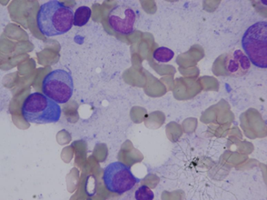
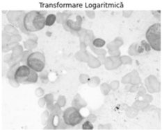
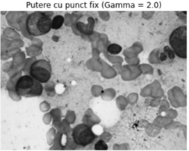
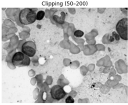
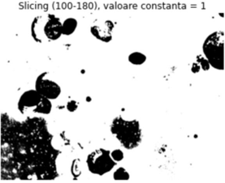
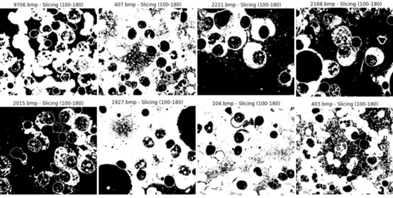
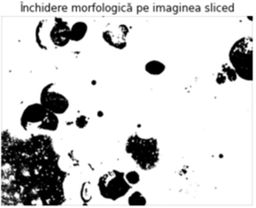
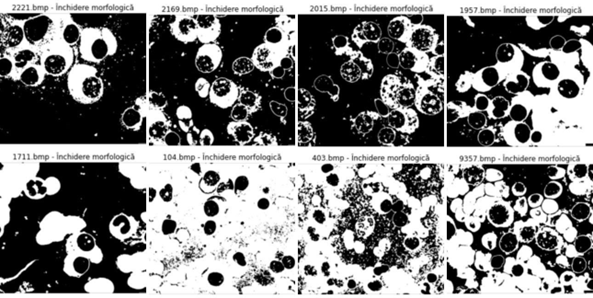

# Leukemia White Blood Cell Segmentation

This project implements an image processing pipeline for detecting and analyzing white blood cells in blood smear images, with a focus on identifying atypical cells associated with leukemia.

---

## Introduction

Segmentation of white blood cells is critical in medical image analysis for diagnosis and research. Leukemia is a malignant proliferation of hematopoietic stem cells in the bone marrow. Accurate identification of abnormal leukocytes (blasts) aids early diagnosis and automated analysis.

This project focuses on microscopic blood smear images and applies image processing techniques including contrast enhancement, segmentation, morphological operations, and feature extraction.

---

## Workflow

1. Original Image – Input microscopic image of a blood smear.
2. Contrast Enhancement:
   - Logarithmic Transform – amplifies low-intensity areas, compresses high-intensity values.
   - Power-Law (Gamma) Transform (γ=2.0) – emphasizes already bright regions.
   - Clipping (50–200) – enhances mid-range contrast, best highlighting leukemic cells.
3. Segmentation:
   - Slicing – isolates white blood cells based on intensity thresholds (100–180).
4. Morphological Operations:
   - Closing – repairs fragmented cells, fills internal gaps, smooths contours.
5. Feature Extraction:
   - Count, area, roundness, and compactness of cells for automated classification.

---

## Image Results

### Original Image

### Logarithmic Transform

### Power Gamma Transform

### Clipping

### Segmentation (Slicing)

### Morphological Operations (Closing)

---

## Observations and Conclusions

1. Segmentation is essential for highlighting abnormal leukemic cells.
2. Clipping gave the best contrast enhancement, clearly separating blasts from the background and preserving nuclear details.
3. Slicing effectively segments white blood cells, but intensity variation in pathological images may require adaptive thresholds.
4. Morphological closing improves segmentation quality by repairing broken edges, filling gaps, and reducing noise.
5. Feature extraction enables automated quantitative analysis:
   - Cell count for leukocytosis detection.
   - Cell area, shape, and roundness for classifying immature or abnormal leukocytes.
6. Proper preprocessing and calibration of thresholds are critical for accurate automated leukemia detection.

---

## Files in this Repository

- leukemia-image-processing.py – Python code implementing the image processing pipeline  
- SegmentationofWhiteBloodCells(WBCs)inBlood.pdf – optional detailed explanation of methods (translated into English)  
- Images uploaded in root folder:
  - original.png
  - log-transf.png
  - powergamma.png
  - clipping.png
  - slicing.png
  - slicing-examples.png
  - closing.png
  - closing-examples.png

  - final_features.png
